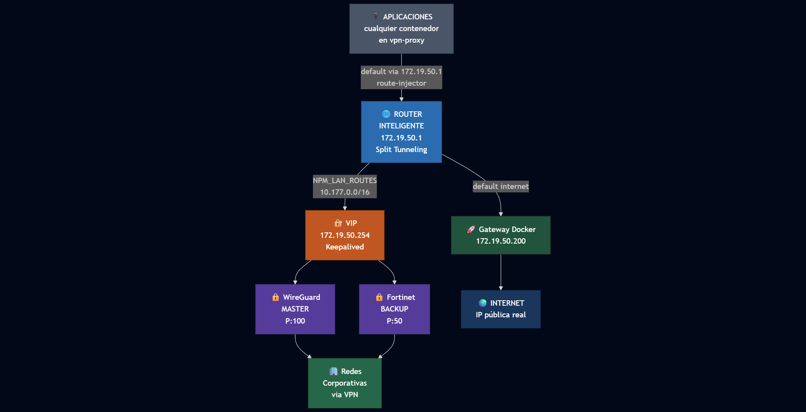

# Router VPN NPM

Stack de Docker para enrutamiento de tráfico a través de VPN con alta disponibilidad y proxy reverso.

## Arquitectura

## Características

- **Split Tunneling**: Solo el tráfico a redes corporativas va por VPN
- **NAT para Internet**: El router hace MASQUERADE para tráfico a internet (via gateway Docker)
- **Alta Disponibilidad**: Failover automático (~5s) entre WireGuard y Fortinet via Keepalived
- **Router Inteligente**: Si las VPNs no responden, el tráfico va por gateway directo (útil dentro de red corporativa)
- **Inyección automática de rutas**: Los contenedores no necesitan `NET_ADMIN`
- **Proxy reverso**: Nginx Proxy Manager para gestión de dominios y SSL
- **Health checks**: Todos los servicios tienen verificación de salud configurada
- **Límites de recursos**: CPU y RAM limitados por contenedor

## Requisitos

- Docker Engine 27+
- Docker Compose v2
- Kernel con soporte TUN (no requiere PPP)

## Instalación

### 1. Clonar y configurar

```bash
cd /ruta/a/router_vpn_npm

# Copiar configuración de ejemplo
cp .env.example .env

# Editar con tus valores
nano .env
```

### 2. Configurar variables

Edita `.env` con tus credenciales:

```env
# WireGuard
VPN_ENDPOINT=tu-servidor-wireguard.com
WIREGUARD_PUBLIC_KEY=...
WIREGUARD_PRIVATE_KEY=...
WIREGUARD_PRESHARED_KEY=...
WIREGUARD_ADDRESSES=10.0.0.2/32

# Fortinet (usa OpenConnect)
FORTICLIENT_HOST=vpn.empresa.com
FORTICLIENT_USER=tu_usuario
FORTICLIENT_PASSWORD=tu_contraseña
FORTICLIENT_TRUSTED_CERT=pin-sha256:xxx...

# IP para verificar conectividad VPN (red corporativa)
HEALTH_CHECK_IP=10.177.73.1

# Redes que van por VPN
NPM_LAN_ROUTES=10.177.0.0/16,172.16.1.0/24
```

### 3. Ejecutar

```bash
./init.sh
```

El script:
1. Protege archivos sensibles (chmod 600)
2. Detiene contenedores existentes
3. Verifica/crea la red Docker `vpn-proxy`
4. Crea directorios de datos
5. Levanta todos los servicios

## Uso

### Conectar una aplicación a la VPN

Solo agrega la red `vpn-proxy` a tu contenedor:

```yaml
# docker-compose.yaml de tu app
services:
  mi-app:
    image: mi-imagen
    networks:
      - vpn-proxy

networks:
  vpn-proxy:
    external: true
```

El `route-injector` detectará automáticamente el contenedor y configurará su ruta.

### Verificar conectividad

```bash
# IP pública (debe ser tu IP real, NO la VPN)
docker run --rm --network vpn-proxy curlimages/curl -s ifconfig.me

# Acceso a red corporativa (via VPN)
docker run --rm --network vpn-proxy alpine ping -c 2 10.177.73.102
```

### Ver estado de los servicios

```bash
# Estado de contenedores
docker ps --format 'table {{.Names}}\t{{.Status}}'

# Logs del router
docker logs router | tail -20

# Verificar quién tiene la VIP
docker exec wireguard_gw ip addr show eth0 | grep 172.19.50.254
docker exec fortinet_gw ip addr show eth0 | grep 172.19.50.254

# Logs de cada servicio
docker logs wireguard_gw
docker logs fortinet_gw
docker logs route-injector
```

### Nginx Proxy Manager

Accede al panel de administración:
- URL: `http://<tu-servidor>:81`
- Email: valor de `ADMIN_EMAIL` en .env
- Contraseña: valor de `ADMIN_PWD` en .env

## Estructura de archivos

```
router_vpn_npm/
├── docker-compose.yaml      # Definición de servicios
├── .env                     # Configuración (NO commitear)
├── .env.example             # Plantilla de configuración
├── .gitignore               # Exclusiones de git
├── init.sh                  # Script de inicialización
├── dockerfiles/
│   ├── Dockerfile.router
│   ├── Dockerfile.route-injector
│   ├── Dockerfile.wireguard-ha
│   ├── Dockerfile.fortinet-ha
│   ├── Dockerfile.npm
│   └── scripts/
│       ├── start_router.sh
│       ├── route-injector.sh
│       ├── start_wireguard-ha.sh
│       ├── start_fortinet-ha.sh
│       ├── start_npm.sh
│       ├── check_vpn.sh
│       ├── keepalived-wireguard.conf.template
│       └── keepalived-fortinet.conf.template
├── stack_data/              # Datos persistentes (creado por init.sh)
│   ├── gluetun/
│   ├── forticlient/logs/
│   └── npm/
└── README.md
```

## Variables de entorno

### General

| Variable | Predeterminado | Descripción |
|----------|----------------|-------------|
| `TZ` | America/Mexico_City | Zona horaria |
| `DATA_PATH` | ./stack_data | Ruta para datos persistentes |

### Red Docker

| Variable | Predeterminado | Descripción |
|----------|----------------|-------------|
| `NETWORK_NAME` | vpn-proxy | Nombre de la red Docker |
| `NETWORK_SUBNET` | 172.19.50.0/24 | Subred de la red |
| `NETWORK_GATEWAY` | 172.19.50.200 | Gateway de la red Docker |

### IPs estáticas

| Variable | Predeterminado | Descripción |
|----------|----------------|-------------|
| `ROUTER_IP` | 172.19.50.1 | IP del router |
| `WIREGUARD_IP` | 172.19.50.253 | IP del gateway WireGuard |
| `FORTINET_IP` | 172.19.50.252 | IP del gateway Fortinet |
| `NPM_IP` | 172.19.50.250 | IP de Nginx Proxy Manager |

### Keepalived (Alta Disponibilidad)

| Variable | Predeterminado | Descripción |
|----------|----------------|-------------|
| `KEEPALIVED_VRID` | 50 | ID del Router Virtual |
| `KEEPALIVED_VIP` | 172.19.50.254 | IP Virtual flotante |
| `KEEPALIVED_AUTH` | vpnproxy | Contraseña VRRP |
| `HEALTH_CHECK_IP` | 10.177.73.1 | IP para verificar VPN (red corporativa) |

### WireGuard

| Variable | Descripción |
|----------|-------------|
| `VPN_ENDPOINT` | Servidor WireGuard |
| `VPN_PORT` | Puerto (predeterminado: 51820) |
| `WIREGUARD_PUBLIC_KEY` | Clave pública del servidor |
| `WIREGUARD_PRIVATE_KEY` | Clave privada del cliente |
| `WIREGUARD_PRESHARED_KEY` | Clave pre-compartida |
| `WIREGUARD_ADDRESSES` | IP asignada al cliente |

### Fortinet (OpenConnect)

| Variable | Descripción |
|----------|-------------|
| `FORTICLIENT_HOST` | Servidor Fortinet |
| `FORTICLIENT_PORT` | Puerto (predeterminado: 443) |
| `FORTICLIENT_USER` | Usuario |
| `FORTICLIENT_PASSWORD` | Contraseña |
| `FORTICLIENT_TRUSTED_CERT` | Certificado en formato `pin-sha256:xxx` |
| `FORTICLIENT_INTERFACE` | Interfaz VPN (predeterminado: tun0) |

### Enrutamiento

| Variable | Descripción |
|----------|-------------|
| `NPM_LAN_ROUTES` | Redes que van por VPN (separadas por coma) |

## Solución de problemas

### El contenedor no tiene ruta hacia el router

```bash
# Ver logs del route-injector
docker logs route-injector

# Verificar manualmente la ruta dentro del contenedor
docker exec mi-contenedor ip route
```

### WireGuard no conecta

```bash
# Ver logs de gluetun
docker logs wireguard_gw

# Verificar interfaz tun0
docker exec wireguard_gw ip addr show tun0
```

### Fortinet no conecta

```bash
# Ver logs de openconnect
docker logs fortinet_gw

# Verificar interfaz tun0
docker exec fortinet_gw ip addr show tun0
```

### Obtener FORTICLIENT_TRUSTED_CERT

El certificado debe estar en formato `pin-sha256:xxx`. Se obtiene del error de conexión:

**Opción 1: Dejar que falle y copiar el hash**

```bash
# Ejecutar openconnect sin certificado - fallará pero mostrará el hash
docker run --rm -it openconnect/openconnect \
  openconnect --protocol=fortinet vpn.empresa.com:443

# El error mostrará algo como:
# Certificate has unknown hash:
# pin-sha256:OxeugppbJVcrBexX8orakogYLI1PhANblNuNCVefEFg=
```

Copia la línea completa `pin-sha256:xxx` a `FORTICLIENT_TRUSTED_CERT` en tu `.env`.

**Opción 2: Con openssl manualmente**

```bash
# Obtener certificado y calcular pin-sha256
echo | openssl s_client -connect vpn.empresa.com:443 2>/dev/null | \
  openssl x509 -pubkey -noout | \
  openssl pkey -pubin -outform DER | \
  openssl dgst -sha256 -binary | base64

# Agregar prefijo pin-sha256: al resultado
```

### La VIP no responde

```bash
# Verificar keepalived en ambos gateways
docker exec wireguard_gw ps aux | grep keepalived
docker exec fortinet_gw ps aux | grep keepalived

# Verificar que la VIP está asignada
docker exec wireguard_gw ip addr show eth0 | grep 172.19.50.254
docker exec fortinet_gw ip addr show eth0 | grep 172.19.50.254
```

### Router usando fallback (gateway directo)

Si el router está enviando tráfico por el gateway directo en lugar de la VPN:

```bash
# Ver logs del router
docker logs router | grep -E "(VPN|fallback|gateway)"

# Verificar si la VIP responde
docker exec router ping -c 1 172.19.50.254

# Si la VIP no responde, verificar keepalived en los gateways
```

## Recursos utilizados

| Servicio | CPU | RAM |
|----------|-----|-----|
| router | 0.25 | 64 MB |
| route-injector | 0.25 | 64 MB |
| wireguard_gw | 0.5 | 256 MB |
| fortinet_gw | 0.5 | 256 MB |
| npm | 1.0 | 512 MB |
| **Total** | **2.5** | **~1.2 GB** |

## Notas técnicas

- **NAT en Router**: El router aplica MASQUERADE solo para tráfico a internet (`! -d 172.19.50.0/24`). El tráfico a VPN no necesita NAT aquí porque lo hace el VPN gateway.
- **Fortinet usa OpenConnect**: Se usa `openconnect --protocol=fortinet` en lugar de openfortivpn porque no requiere el módulo PPP del kernel (común en servidores cloud)
- **Interfaz TUN**: Ambas VPNs usan `tun0` (no ppp0)
- **Keepalived robusto**: Los scripts limpian archivos PID al inicio y monitorean keepalived cada 10s con reinicio automático

## Licencia

MIT


